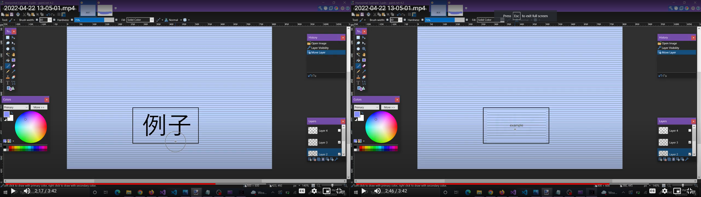

## Machine Translation Integration Layer

### Creators: Md Abubakkar, Parker Hagmaier, and Caleb Sneath
#### Date: April 27, 2022

### Description:

This repository contains the source code for a project made for the author's software engineering course, the Machine Translation Integration Layer (MTIL). The MTIL is a simple program aimed at creating a product that can be used by future or possibly even current desktop machine translation software applications in order to improve the viewing experience of translated software. It does this by focusing exclusively on the display of the translated text while currently providing two separate pathways for translation applications to feed this application text: the clipboard and several custom input files. Additionally, as machine translation is currently far from perfect, the MTIL can support outputting of text from eight simultaneous sources, allowing the user to output and compare multiple translations of the same text at a time, as well as view translations of multiple different separate elements on the screen. The translations are outputted directly to the screen and there are currently several different options to try and mimic the surrounding screen area automatically as the surrounding application changes. Additionally, the area the text will be outputted to be configured and changed at runtime using either hotkeys or a minimizable textbox GUI with coordinates. Finally to clarify, this program is not concerned itself with the translation of text, merely as a way to potentially improve the viewing of translated text. It will not translate anything for you itself, so if you wanted to, you could even theoretically use the program as a fancy textbox overlay for your screen. 

### Advantages and Features:
The last point above may seems like a fairly large disadvantage for a program, but it's a fairly intentional design choice with several benefits:
#### Robustness
- Several translation applications over the years have directly scanned the target application for text, grabbed it, and made use of a translation API all in one to translate applications. Several of these APIs have been updated, changing how calls to the API are made and breaking these applications. This means that all of these applications which were not updated by their authors are now largely broken and useless. In contrast, as long as a single translation application that is compatible with this application is either updated or makes use of an offline translation tool, the translation experience can be improved, even if this project is abandoned. This was partially inspired by the development of text hooking applications and visual optical character recognition applications. Originally, whole applications would be made for grabbing the text from the target applicaion as well as the translation and viewing. Over time, the first two responsiblilities have become separated greatly reducing application breakage, so it seems like a natural evolution to continue the trend for the display side.
#### Separation of Responsibilities
- A large amount of application machine translation software is done by volunteer and open source teams and not for profit. This means that it is important to preserve the limited volunteer talent that is dedicated to the cause. By separating the display of text from the translation and original obtaining of it, it allows the limited developers to better focus on what aspect they would be best suited for, whether that be scraping applications for text, making use of translation API calls, or even developing whole new improved translation libraries and APIs. This should hopefully allow future machine translation projects to create better and more specialized projects with developers focusing on just what they are best at.
#### Improved User Experience
- Currently, the user experience of using any kind of machine translation outside of web browsers is quite poor. It essentially amounts to either switching back and forth between your target application and a small window that shows the translation, using two monitors, or shrinking the window to look back and forth between the translation and application window, all of which deeply break immersion within the application. If the user is lucky, their application is one of the few such as RPG Maker which has had a program designed to then take the translation and replace the original text inside the application with it. Of course, this is rather rare and has a number of problems. It requires a developer deeply aware of the internal workings of the target application to know how to find and replace the correct text as the application runs. This means an application so specialized you start to run into the issues mentioned in the robustness section above. Furthermore, arbitrarily injecting unexpected text into either memory or a program file can cause a number of issues. Examples include text overrunning the textbox that fit in one language but not another, accidentally stripping important syntactical characters on interpreted code, and accidentally modifying unrelated memory locations. These can all range from mild annoyances to literal application crashing issues. This approach is a way that intentionally hides the implementation details for the target application and the translation, allowing it to be used across different applications. Additionally, text attempts to wrap and dynamically resize to fit within a target location, although after a point the user will have to simply resize the box to display their text still.

### Files

|   #   | File            | Description                                        |
| :---: | --------------- | -------------------------------------------------- |
|   1   | [Source.cpp](https://github.com/CalebSneath/MTIL/Source.cpp)         | Main function and driver code for program.    |
|   2   | [user_interface.cpp](https://github.com/CalebSneath/MTIL/user_interface.cpp)         | File that contains a class containing the program main event loop and control logic.   |
|   3   | [user_interface.h](https://github.com/CalebSneath/MTIL/user_interface.h)         | File that contains header information for the user interface class.   |
|   4   | [user_interface.cpp](https://github.com/CalebSneath/MTIL/user_interface_primitives.cpp)         | File that contains a custom library of drawable Direct 2D shapes and working UI elements. |
|   5   | [user_interface.h](https://github.com/CalebSneath/MTIL/user_interface_primitives.h)         | File that contains header information for user_interface_primitives. |
|   6   | [user_interface.cpp](https://github.com/CalebSneath/MTIL/integration_inputs.cpp)         | File that contains information on classes involved in obtaining pretranslated text from various sources. |
|   7   | [user_interface.h](https://github.com/CalebSneath/MTIL/integration_inputs.h)         | File that contains header information for the integration_inputs class.   |
|   8   | [user_interface.cpp](https://github.com/CalebSneath/MTIL/integration_outputs.cpp)         | File that contains class implementations for classes involved in displaying text in a way that mimics its surrounding screen area. |
|   9   | [user_interface.h](https://github.com/CalebSneath/MTIL/integration_outputs.h)         | File that contains header information on integration_outputs.cpp.   |
|   10   | [Labyrinth.ico](https://github.com/CalebSneath/MTIL/Labyrinth.ico)         | File that contains program icon.  |
|   11   | [Labyrinth.png](https://github.com/CalebSneath/MTIL/Labyrinth.png)         | Program image asset.   |
|   12   | [Image Files.conf](https://github.com/CalebSneath/MTIL/Image_Files.conf)         | Configuration file for configuring output image source names. |
|   13   | [Input Sources.conf](https://github.com/CalebSneath/MTIL/Input_Sources.conf)         | Configuration file for configuring input source file name.   |
|   14   | [Output Offset.conf](https://github.com/CalebSneath/MTIL/Output_Offset.conf)         | Configuration file to allow user to finetune small details about how the program looks at the nearby screen environment for performance or accuracy. |
|   15   | [Example.png](https://github.com/CalebSneath/MTIL/Example.png)         | A screenshot showing off the program usage. |
|   16   | [UI Finished.png](https://github.com/CalebSneath/MTIL/UI_Finished.png)         | A screenshot showing off the configuration GUI. |
|   17   | [Everything Else]     | Various preset files to be used as examples for program use.  |

### Compilation Instructions

Compilation is incredibly simple. Just do one of the following:
#### Method 1:
- Download Visual Studio. The program was made with Visual Studio 2019. Other versions are untested, but probably work fine.
- Download all of the files in this repository using your preferred method. 
- Open a new project in Visual Studios using the empty C++ project template.
- Right click on the "source files folder" on the right and click on "add existing item".
- Copy and paste the contents of this directory from wherever you stored it in the earlier step into this directory and add all of the pasted files.
- Click "Build" and then "Build solution". Your .exe will now be in nested somewhere in the Visual Studios directory your project created.
- Copy the .exe to wherever you first stored the contents of this directory. Optionally delete the .h and .cpp files in that directory. You can now run the program.
#### Method 2: 
- Clone this repository using Visual Studios if you know how. Proceed to the second to last step of Method 1.

### Usage instructions

- If you want to change the names of the input files for image backgrounds or input text, go ahead and do so in the config files. Files used by the program must be in the target directory and not contain spaces, although paths using the relative or absolute directory are also acceptable so long as they have no spaces at the moment. 
- Launch the .exe. 
- You can then go ahead and choose which stream of the eight you want to configure. 
- Select the input method.
- Select whether to choose coordinates with hotkey or with manual numeric entry in the text box. 
- Select your desired output style.
- Configure your output coordinates. The program will now work.
- Note: All steps must be completed for each stream to work.

### Credits:
Sections of code obtained from Microsoft's documentation and tutorial pages on Windows.h and Direct 2D.
- https://docs.microsoft.com/en-us/windows/win32/learnwin32/learn-to-program-for-windows
